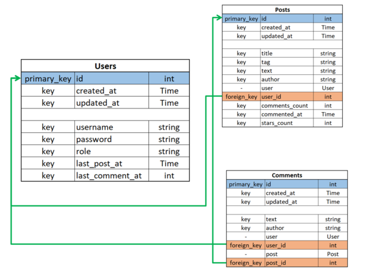

# 📦 Models

There are 3 models used in this project:

- user: See [user.go](../models/user.go)
- post: See [post.go](../models/post.go)
- comment: See [comment.go](../models/comment.go)

Each of them also inherit from the [base model](../models/base.go) which contains 3 base attributes:

```py
- ID          # PrimaryKey
- CreatedAt   # Time that entry was created
- UpdatedAt   # Time that entry was updated
```

## Relational diagram



<br/>

# 🛣️ API Endpoints

API routing is split into 2 access-level categories:

1. `public`:

   - Low level access
   - Routes in this category are defined in [public.go](../routes/public.go)

2. `protected`:
   - Requires user authentication for access (JWT token)
   - Routes in this category are defined in [protected.go](../routes/protected.go)

Below is a quick reference to all API endpoints defined:

- `auth`:

  ```py
  auth (access-level-mixed)
  ├── login (public)      # Login of existing account
  ├── register (public)   # Registration of new account
  └── me (protected)      # Authenticating an existing session using JWT token
  ```

- `posts`:

  ```py
  posts (protected)
  ├── get         # Fetches a list of posts based on given params
  ├── getbyid     # Fetches a single post based on ID (if any)
  ├── create      # Creates a new post
  ├── updatetext  # Updates an existing post text
  └── delete      # Deletes an existing post
  ```

- `comments`:

  ```py
  comments (protected)
  ├── get         # Fetches a list of comments from given postID
  ├── create      # Creates a new comment
  ├── updatetext  # Updates an existing comment text
  └── delete      # Deletes an existing comment
  ```

- `users`:

  ```py
  users (protected)
  ├── getbyid     # Fetches user details based on ID (if any)
  ├── updatebio   # Update user bio
  └── delete      # Deletes user account
  ```

<br/>

# 🎮 Controllers

Each main API path has a dedicated controller to handle requests made to it.

- `auth`: [auth.go](../controllers/auth.go)
- `posts`: [posts.go](../controllers/posts.go)
- `comments`: [comments.go](../controllers/comments.go)
- `users`: [users.go](../controllers/users.go)

Each handler function has been documented in a consistent style:

```go
type ExpectedRequestTypeForHandler {
   RequestParam1  paramType `uri:"requestParam1" json:"requestParam1" binding:"required"`
   // ...
}

func Handler(c *gin.Context) {
   // ...
}
```

An example from `CreatePost` handler in [posts.go](../controllers/posts.go):

```go
type CreatePostRequest struct {
  Title string `json:"title" binding:"required"`
  Tag   string `json:"tag" binding:"required"`
  Text  string `json:"text" binding:"required"`
}

func CreatePost(c *gin.Context) {
	// Check that RequestUser is authenticated
  user, found := VerifyAuth(c)
  if found == false {
    return
  }

  // Parse RequestBody
  var json CreatePostRequest
  if err := c.ShouldBindJSON(&json); err != nil {
    c.JSON(http.StatusBadRequest, gin.H{"message": err.Error()})
    return
  }

  // Request params are now accessible through:
  // json.Title, json.Tag, json.Tag

  // Rest of Handler logic
  // ...
}
```

### JSON vs URI

- All request params for `POST` requests are included in the `JSON` request body.

- Meanwhile, all request params for `GET` and `DELETE` requests are included in the URI instead.

  `ginContext.ShouldBindJSON` and `ginContext.ShouldBindUri` are used to bind and verify the request params accordingly.

<br/>
